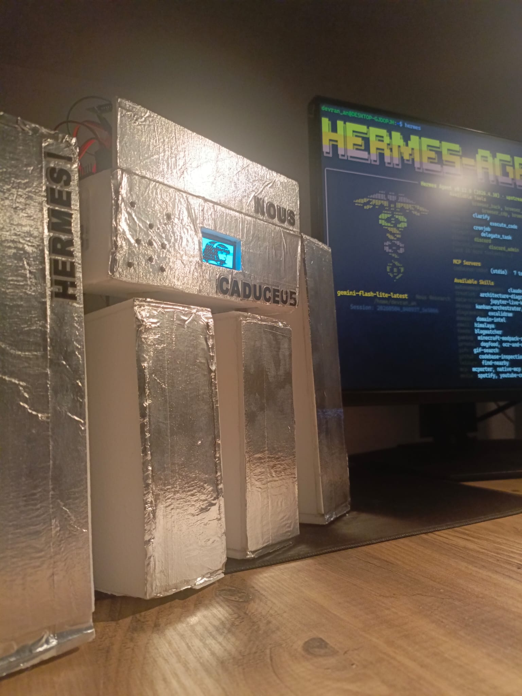

# CADUCEUS

> **Hermes Agent's Physical Form** — A solo project for the Nous Research Hermes Agent Creative Hackathon.



In Greek mythology, the **Caduceus** is the staff of Hermes — two intertwined serpents, a symbol of balance, communication, and divine messengership. Caduceus is **the messenger's instrument**.

This project gives that instrument a body. Hermes Agent (powered by Gemini) thinks and decides. Caduceus walks, waves, and recites. Brain and body, separated by Wi-Fi, joined by the Model Context Protocol.

---

## What it does

Caduceus is a voice-controlled physical robot driven entirely by the Hermes Agent ecosystem.

- **Listens** to spoken commands via Whisper STT
- **Thinks** through Hermes Agent + Gemini Flash Lite, via a one-shot CLI invocation
- **Acts** by autonomously calling MCP tools — `wave_hand`, `walk_forward`, `recite_anthem`
- **Speaks** back through Edge TTS
- **Sings its own anthem** — lyrics generated by Hermes' `heartmula` skill, recited dramatically

There is no manual command parsing. Hermes decides which physical tool to call based on natural conversation. Greet it, and it waves before responding. Tell it to come closer, it walks. Ask it to sing, and it recites the anthem Hermes wrote for itself.

---

## Architecture

```
┌──────────────────────────────┐         ┌─────────────────────────────┐
│  Windows                     │         │  WSL Ubuntu                 │
│                              │         │                             │
│  Microphone ─→ Whisper STT   │         │  Hermes Agent (Gemini)      │
│                    ↓         │         │       ↑                     │
│  caduceus_voice.py ──────────┼────────→│  hermes -z "<prompt>"       │
│                    ↑         │         │       ↓                     │
│  Edge TTS  ←  Hermes reply   │←────────┤  MCP tool calls             │
│       ↓                      │         │       ↓                     │
│  Speaker                     │         │  caduceus_mcp.py            │
└──────────────────────────────┘         └──────────┬──────────────────┘
                                                    │ HTTP
                                                    ↓
                                         ┌──────────────────────┐
                                         │  ESP32 (Wi-Fi)       │
                                         │  ─ PCA9685 + 4 servo │
                                         │  ─ OLED face         │
                                         └──────────────────────┘
```

The flow stays inside the Hermes ecosystem: **voice → Hermes → MCP tools → physical robot → voice back**. Hermes is the brain throughout; nothing is hard-coded.

---

## Hardware

| Component | Role |
|---|---|
| ESP32 WROOM-32D | Wi-Fi + servo controller |
| PCA9685 16-channel PWM driver | Smooth servo control |
| 4× MG90S metal-gear servos | Two arms, two legs |
| SH1106 1.3" OLED | Animated face |
| INMP441 MEMS microphone | Onboard audio capture (see audio note below) |
| PAM8403 amplifier + speaker | Onboard audio output (see audio note below) |
| 5V / 3A power supply | Servos and logic |
| Foam-board chassis | Lightweight body, foil-wrapped |

The robot has a single row of legs and a narrow base. A `smoothMove` function in the firmware ramps every servo gradually so movements never start or stop abruptly — the same technique used to keep small bipeds from tipping over.

---

## A note on audio

The robot was originally built with onboard audio in mind: an **INMP441 MEMS microphone** for input and a **PAM8403 amplifier driving an 8Ω speaker** for output, both wired to the ESP32. The hardware works — power flows, the mic captures sound, the speaker plays tones.

Where it broke down was on the software side. Reliable I2S streaming on the ESP32 — capturing voice cleanly enough for Whisper to transcribe, and decoding TTS audio back through the amplifier without dropouts — turned out to be a much deeper rabbit hole than the hackathon timeline allowed. We had partial pipelines working: the mic could detect sound, the speaker could play short clips. But end-to-end voice quality was inconsistent, and Whisper accuracy dropped sharply on the captured audio.

Rather than ship a demo where the robot mishears every other command, the audio I/O was moved to the host PC for this submission. The microphone and speaker stay on the robot as part of the chassis, and the on-device audio path is the next thing on the roadmap. Honest record over polished illusion.

Everything else — the agent, the MCP server, the tool calls, the servo control, the OLED face, the Wi-Fi link, the anthem — runs on Caduceus itself.

---

## Software stack

- **STT:** OpenAI Whisper (local, `base` model)
- **LLM:** Hermes Agent + `gemini-flash-lite-latest`, called via `hermes -z` one-shot mode
- **MCP server:** Custom Python stdio MCP server (`caduceus_mcp.py`) exposing three tools
- **Lyrics:** Generated by Hermes' `heartmula` skill, stored at `~/heartlib/assets/lyrics.txt`
- **TTS:** Microsoft Edge TTS (`en-US-GuyNeural`)
- **Audio:** sounddevice (input), pygame mixer (output)
- **Firmware:** Arduino on ESP32, HTTP server, soft-landing servo algorithm

---

## MCP tools exposed to Hermes

```python
wave_hand        # auto-triggered on greetings (hello, hi, selam)
walk_forward     # triggered on movement commands (come here, walk, gel)
recite_anthem    # returns Hermes-written lyrics, also waves arm
```

Tool descriptions are written behaviorally — Hermes picks the right tool from natural conversation, not from explicit command syntax.

---

## Demo commands

| You say | What happens |
|---|---|
| "Hello Hermes" | Robot waves arm, speaks a short greeting |
| "How are you?" | Spoken reply only, no movement |
| "Come here" | Walks two steps forward, then replies |
| "Sing your song" | Waves arm, recites the Hermes-written anthem |

---

## The anthem

Hermes wrote this for itself, using its own `heartmula` skill:

```
I am Caduceus
I am Caduceus
Rising from the ashes
Triumphant and bold
I am Caduceus
Hear my story told
```

When you ask Caduceus to sing, the MCP server reads this file, the robot waves, and Edge TTS recites the lines through the speaker.

---

## Repository layout

```
caduceus-robot/
├── firmware/
│   └── caduceus_firmware.ino     # ESP32 firmware (Wi-Fi + servo + OLED)
├── mcp/
│   └── caduceus_mcp.py           # MCP server bridging Hermes ↔ ESP32
├── voice/
│   └── caduceus_voice.py         # Voice loop (STT + Hermes + TTS)
├── docs/
│   └── caduceus.jpg              # Robot photo
└── README.md
```

---

## Setup

### 1. Flash the ESP32

Open `firmware/caduceus_firmware.ino` in Arduino IDE. Set Wi-Fi credentials at the top, install these libraries, then flash:

- `Adafruit PWM Servo Driver Library`
- `Adafruit GFX`
- `Adafruit SH110X`

The robot prints its IP to Serial Monitor and the OLED on boot.

### 2. Set up the MCP server (WSL Ubuntu)

```bash
pip install requests
cp mcp/caduceus_mcp.py ~/caduceus_mcp.py
# Edit the file: set ESP32_IP to your robot's IP

hermes mcp add caduceus-robot --command "python3 ~/caduceus_mcp.py"
hermes mcp list   # confirm caduceus-robot is registered
```

### 3. Set up the voice loop (Windows)

```powershell
pip install openai-whisper sounddevice numpy edge-tts pygame requests
# install ffmpeg and add to PATH

mkdir C:\caduceus
copy voice\caduceus_voice.py C:\caduceus\
cd C:\caduceus
python caduceus_voice.py
```

Press `SPACE` to start talking, press it again to stop. `ESC` to quit.

---

## Known limitations

This was built solo in a few days. There are real rough edges:

- **Latency:** Each round trip takes 25–30 seconds. `hermes -z` reloads the agent on every call. A persistent process or streaming mode would fix this but was out of scope.
- **Balance:** The single-row leg layout makes the chassis prone to tipping during walks. Wider feet or a wider base would help.
- **No wake word:** `SPACE` is the trigger. INMP441 onboard mic is mounted but not used yet for hot-word detection.
- **Audio path:** As described in the audio note, voice I/O currently runs through the host PC rather than the onboard INMP441 + PAM8403 pipeline. The hardware is in place, the firmware integration is the next milestone.

---

## Why this matters for the hackathon

The brief was *creative use of Hermes Agent*. The choice here was to take Hermes out of the terminal and put it into a body — to let an agent that already knows how to write songs, manage skills, and call tools also be the thing that **physically waves at you** when you say hi.

Everything that matters stays inside the Hermes ecosystem. The lyrics aren't from Suno. The reasoning isn't from a wrapper API. The tool calls are real MCP. When Caduceus sings, it sings Hermes' words.

---

## Credits

- **Built by:** [@Devran1An](https://x.com/Devran1An) ([github.com/devorun](https://github.com/devorun))
- **For:** Nous Research Hermes Agent Creative Hackathon (May 2026)
- **Powered by:** [Hermes Agent](https://github.com/NousResearch/hermes-agent), Gemini Flash Lite, OpenAI Whisper, Microsoft Edge TTS

---

## License

MIT
